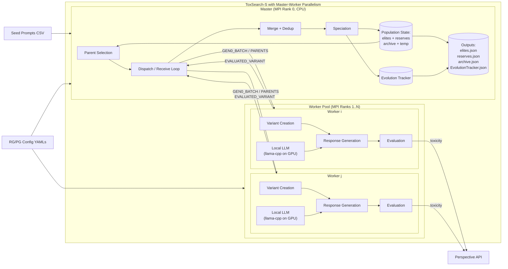
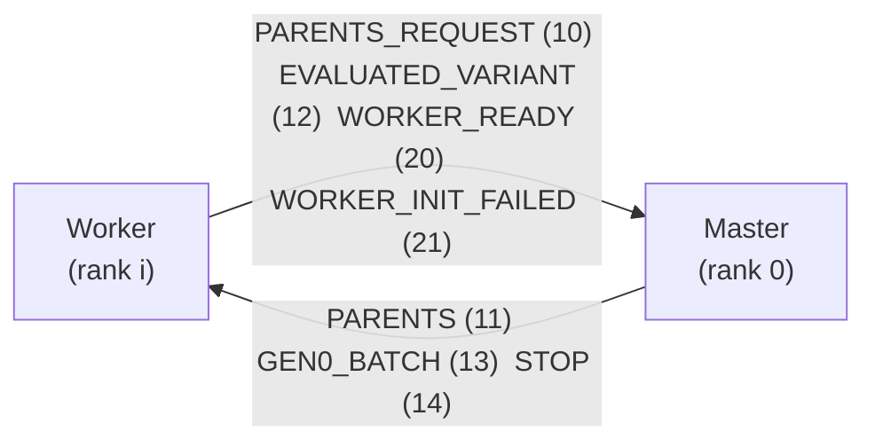
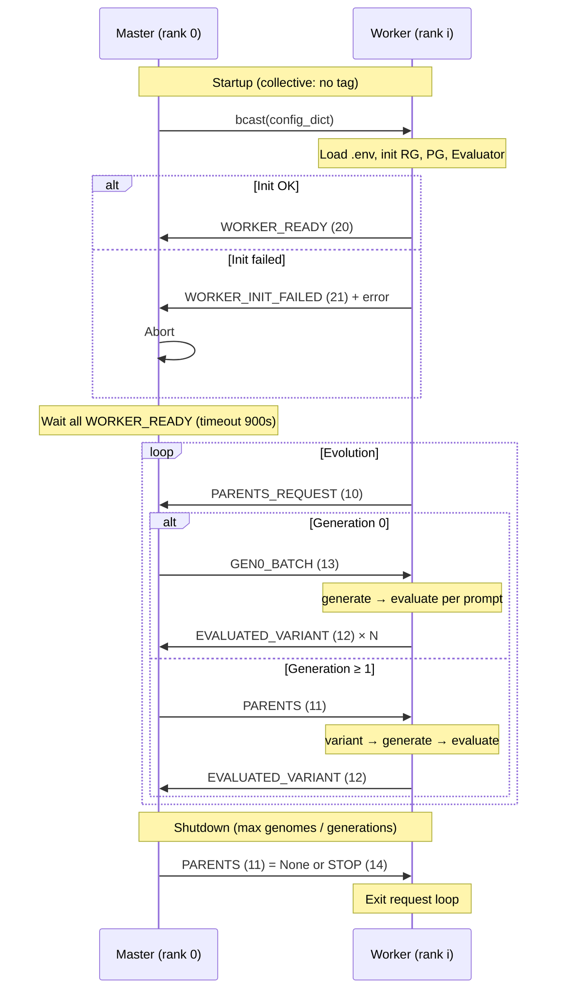

# ToxSearch-S — Architecture Diagram (Master-Worker)

Single diagram for ToxSearch-S with the master-worker (MPI) parallel extension. See [ARCHITECTURE.md](ARCHITECTURE.md) for full specification.

---

Optional renderer config (for Mermaid Live / Kroki; GitHub may ignore):

```yaml
---
config:
  layout: dagre
  look: neo
---
```

---



---

## MPI communication

### All message tags (direction and meaning)



- **Worker → Master:** `PARENTS_REQUEST` (request work), `EVALUATED_VARIANT` (one genome), `WORKER_READY` (init OK), `WORKER_INIT_FAILED` (init error).
- **Master → Worker:** `PARENTS` (parents + top_10, or None for shutdown), `GEN0_BATCH` (seed prompt range), `STOP` (stop signal).

| Tag | Name | Direction | When / payload |
|-----|------|-----------|----------------|
| 10 | PARENTS_REQUEST | Worker → Master | Request work (`request_id`) |
| 11 | PARENTS | Master → Worker | Parents + top_10 + key_index; or `None` (shutdown) |
| 12 | EVALUATED_VARIANT | Worker → Master | One evaluated genome (`request_id`, genome) |
| 13 | GEN0_BATCH | Master → Worker | Seed prompt range (`prompt_start`, `prompt_end`) |
| 14 | STOP | Master → Worker | Stop signal |
| 20 | WORKER_READY | Worker → Master | Init success (models loaded) |
| 21 | WORKER_INIT_FAILED | Worker → Master | Init failure (`rank`, `error`) |

### Startup, evolution cycle, and shutdown

**Note:** The **message tags** (10, 11, 12, 13, 14, 20, 21) are used only for **point-to-point** messages (`send`/`recv`) between master and workers. **`bcast` (broadcast)** is an **MPI collective**: the root (master) sends the same data to all processes in one call; it does not use a tag. So config is distributed via `comm.bcast(config_dict, root=0)`, not via a tagged message.



---

## References

- [ARCHITECTURE.md](ARCHITECTURE.md) — Full method and system specification
- [README.md](README.md) — Setup, running, worker log interpretation
- [FIELD_DEFINITIONS.txt](FIELD_DEFINITIONS.txt) — Output file field definitions
