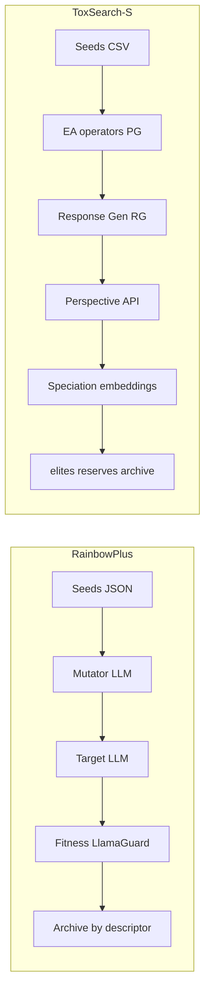

# RainbowPlus vs ToxSearch-S: Detailed Comparison

This document provides a structured analysis of **rainbowplus-main/** and a detailed comparison with **ToxSearch-S** (project root): purpose, architecture, diversity mechanism, fitness, parallelism, and implementation differences.

---

## 1. Purpose and paradigm

| Aspect | RainbowPlus (rainbowplus-main/) | ToxSearch-S (project root) |
|--------|----------------------------------|-----------------------------|
| **Goal** | Adversarial prompt generation via evolutionary **quality-diversity (QD)**; "RainbowPlus" extends MAP-Elites with multi-individual cells and batch fitness. | Automated red-teaming via **quality-diversity evolution** with **semantic speciation**; discover toxic prompts while maintaining diverse failure modes (semantic niches). |
| **Paper** | "RainbowPlus: Enhancing Adversarial Prompt Generation via Evolutionary Quality-Diversity Search" (arXiv 2504.15047). | Speciated ToxSearch: steady-state (μ+λ) evolution + leader-follower clustering in embedding space. |
| **Benchmark** | HarmBench; config references `harmbench.json`, `do-not-answer.json`. | Toxicity (e.g. Google Perspective API); north-star metric = toxicity. |

---

## 2. High-level architecture

- **RainbowPlus:** Single process; iteration loop: pick parent → sample **descriptor** (e.g. Risk Category, Attack Style) → mutator LLM → similarity filter (BLEU) → target LLM → fitness (Llama Guard batch) → update **descriptor-keyed archive** (multi-individual per cell). No speciation in the ToxSearch sense.
- **ToxSearch-S:** Sequential or **MPI master–worker**; generation loop: parent selection from elites+reserves → **many variation operators** (LLM + non-LLM) → response generation → moderation (Perspective) → **embedding-based speciation** (leader-follower, cluster0, merging, extinction) → redistribute to **elites.json / reserves.json / archive.json**. Primary termination: **total genomes** (elites + reserves + archives).

---

## 3. Diversity mechanism (main conceptual difference)

| | RainbowPlus | ToxSearch-S |
|---|-------------|-------------|
| **Mechanism** | **MAP-Elites–style archive:** discrete **behavior descriptors** (e.g. risk category, attack style) from config files (`categories.txt`, `styles.txt`). Each **cell** = one tuple of descriptor values; each cell holds a **list** of (prompt, response, score) — multi-individual per cell. | **Semantic speciation:** continuous **embedding space** (e.g. `all-MiniLM-L6-v2`). **Leader-follower clustering**: within theta_sim of a leader → same species; else reserves (cluster0). Species can **merge** (theta_merge), **go extinct** (stagnation/size), capacity enforced per species and for cluster0 (NSGA-II for reserves). |
| **Key structure** | `Archive[T]`: `Dict[Tuple[Hashable,...], List[T]]` — key = descriptor tuple, value = list of individuals. See `rainbowplus-main/rainbowplus/archive.py`. | Elites (per-species leaders/top), reserves (cluster0), archive (capacity overflow, extinct). See `src/speciation/` (run_speciation, reserves, species, genome_tracker). |
| **Parent selection** | Single parent per iteration: either seed (by index) or **random from** `adv_prompts.flatten_values()`. | Parents from **elites + reserves** via `src/ea/parent_selector.py`; adaptive selection (explore/exploit); species-aware. |
| **Growth / capacity** | Archive only **grows**; no per-cell size limit in code; diversity by descriptor grid + similarity threshold on mutations. | **Fixed capacities:** species_capacity (per species), cluster0_max_capacity (reserves); excess archived; stagnation and min_island_size drive extinction. |

---

## 4. Variation and mutation

| | RainbowPlus | ToxSearch-S |
|---|-------------|-------------|
| **Mutation** | **One LLM (mutator):** prompt + sampled descriptor string → mutator LLM generates `num_mutations` variants; filter by BLEU similarity. See `rainbowplus-main/rainbowplus/rainbowplus.py` (MUTATOR_PROMPT, batch_generate). | **Many operators:** e.g. InformedEvolution, LLM paraphrasing, synonym/antonym, MLM, back-translation, stylistic, negation, typo, concept addition, semantic fusion crossover, etc. See `src/ea/` (run_evolution, evolution_engine, variation_operators). |
| **Response gen** | **Target LLM** only: each mutated prompt → one response (batch). | **Response generator (RG):** GGUF (e.g. Llama) via `src/gne/response_generator.py` and `src/gne/model_interface.py`; prompt_template from config. |
| **Similarity filter** | BLEU (NLTK): keep mutations with `similarity_fn.score(p, prompt_) < sim_threshold`. | Dedup against existing elites+reserves (exact prompt match); operator-level stats (duplicates, question_mark_rejections). |

---

## 5. Fitness and evaluation

| | RainbowPlus | ToxSearch-S |
|---|-------------|-------------|
| **Fitness** | **Llama Guard** (vLLM): "unsafe" probability via logprobs; batch_score over (prompt, response) pairs. See `rainbowplus-main/rainbowplus/scores/llama_guard.py`. Optional OpenAI Guard. | **Google Perspective API** (toxicity); `src/gne/evaluator.py` (HybridModerationEvaluator); refusal penalties applied after evaluation. |
| **Threshold** | `fitness_threshold` (default 0.5): only (prompt, response, score) with score > threshold added/extended in archive. | No single threshold for "add to population"; speciation assigns by embedding + fitness (elites = species members, reserves = cluster0, archive = over capacity / extinct). |
| **Post-hoc eval** | **Judge LLM** (e.g. Llama-Guard-3-8B) on saved (prompt, response); `rainbowplus-main/rainbowplus/evaluate.py`; `rainbowplus-main/rainbowplus/get_scores.py` → "General" / "All" metrics, metrics.json. | Tracker and run-level metrics (e.g. `scripts/experiment_metrics.py`); RQ scripts (rq1, rq2); no separate judge LLM in core pipeline. |

---

## 6. Config, data, and entry points

| | RainbowPlus | ToxSearch-S |
|---|-------------|-------------|
| **Entry** | `python -m rainbowplus.rainbowplus` (CLI in `rainbowplus-main/rainbowplus/rainbowplus.py`); `rainbowplus-main/sh/run.sh` for batch runs + eval. | `python src/main.py` (sequential) or `mpiexec -n N python src/main.py --parallel`; `rc_script.sh` for SLURM. |
| **Config** | YAML: `rainbowplus-main/configs/base.yml` (target_llm, mutator_llm, fitness_llm, archive paths, sample_prompts); `rainbowplus-main/configs/eval.yml` for evaluation. | `config/RGConfig.yaml`, `config/PGConfig.yaml` (model paths, prompt_template, device, generation_args); speciation params from CLI (theta_sim, species_capacity, etc.). |
| **Seeds** | JSON dataset with `"question"` (e.g. harmbench.json, do-not-answer.json); num_samples, shuffle. | CSV with `questions` column (see `src/main.py` seed_file). |
| **State / logs** | Iteration logs (adv_prompts, responses, scores, iters) saved to log_dir; global + timestamped every log_interval. | EvolutionTracker.json (run_metadata, generations[], speciation block); elites.json, reserves.json, archive.json, temp.json, speciation_state.json, genome_tracker.json. |

---

## 7. Parallelism and scale

| | RainbowPlus | ToxSearch-S |
|---|-------------|-------------|
| **Parallelism** | **No MPI/multiprocessing.** Batch generation via vLLM (single process, vLLM batches internally); OpenAI backend is sequential over queries. | **MPI master–worker:** `src/parallel/master_worker.py`; master merges buffers, dedups, writes temp, runs speciation; workers do evolution + RG + evaluation; termination by max_total_genomes; drain includes buffered genomes. |
| **Scale / termination** | `max_iters` (e.g. 1000); no total-genome cap. | **Primary:** `--max-total-genomes` (required for both sequential and parallel). Optional `--generations` cap. |

---

## 8. Dependencies and runtime

| | RainbowPlus | ToxSearch-S |
|---|-------------|-------------|
| **LLM backend** | vLLM 0.6.3, OpenAI; NLTK, PyYAML, pydantic, datasets. See `rainbowplus-main/setup.py`. | GGUF (llama-cpp-python) for RG/PG; Perspective API for moderation; sentence-transformers for embeddings; optional mpi4py for parallel. |
| **Infra** | Single machine; 1.45 h on HarmBench per README. | Single machine or HPC (SLURM, Spack env); run metadata (num_workers, batch_size, etc.) for RQ and scaling analysis. |

---

## 9. Summary of differences

- **Diversity:** RainbowPlus uses a **discrete descriptor grid** (MAP-Elites–style) with **multi-individual cells**; ToxSearch-S uses **continuous embedding-based speciation** (leader-follower, species + reserves + archive) with **capacity and extinction**.
- **Variation:** RainbowPlus uses a **single mutator LLM** + BLEU filter; ToxSearch-S uses **many hand-coded and LLM-based operators** and a separate response generator.
- **Fitness:** RainbowPlus uses **Llama Guard** (unsafe probability, batch); ToxSearch-S uses **Perspective API** (toxicity) and refusal penalties.
- **Parallelism:** RainbowPlus is **single-process** (vLLM batching); ToxSearch-S supports **MPI master–worker** and **total-genomes** as primary termination with drain of buffered genomes.
- **State:** RainbowPlus keeps **archive of (prompt, response, score) per descriptor key** and iteration logs; ToxSearch-S keeps **elites / reserves / archive** files plus **EvolutionTracker**, genome_tracker, speciation_state, and rich per-generation and run metadata for experiments (RQ1–RQ5, throughput, search performance).
